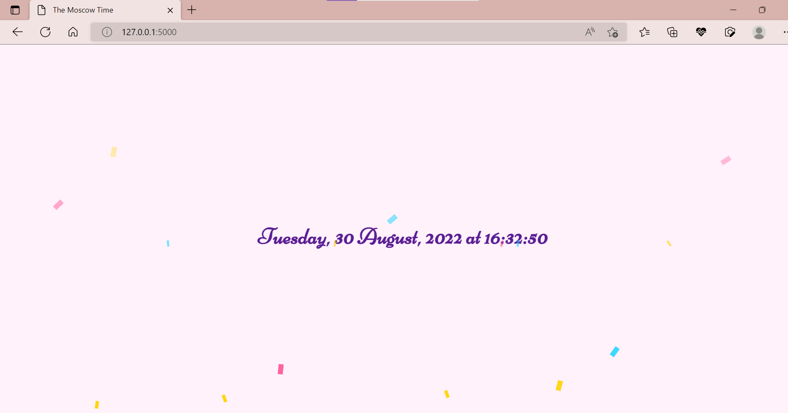

# DevOps Course. Time app

This project is a website that will show the current time in Moscow

<!-- TABLE OF CONTENTS -->
<details>
  <summary>Table of Contents</summary>
  <ol>
    <li>
      <a href="#about-the-project">About The Project</a>
    </li>
    <li>
      <a href="#getting-started">Getting Started</a>
    </li>
    <li><a href="#usage">Usage</a></li>
    <li><a href="#contributing">Contributing</a></li>
    <li><a href="#contact">Contact</a></li>
  </ol>
</details>

</br>

<!-- ABOUT THE PROJECT -->
## About The Project

This project is a website that will show the current time in Moscow.
The goal of the project is to get acquainted with DevOps practices by creating a
project using Python. Also, the best
practices for the Python Web app creation
should be researched and applied. For instance,
linters for the code and the Markup, as well as Prettier as a code formatter.
I have decided to make a minimalistic website
with a simple confetti animation.
The time is updated after reloading the page.
</br>

### Built With

* [![Flask][Flask.com]][Flask-url]

<!-- GETTING STARTED -->
## Getting Started

To get a local copy up and running follow these simple example steps.

### Prerequisites

Since I used VSCode to create an application using Flask,
below I leave instructions on how to prepare the interaction between VSCode
and Flask. Feel free to use any other code editor to set up this project
locally. My prerequisites were based on these instructions:
[python-sample-vscode-flask-tutorial](https://github.com/microsoft/python-sample-vscode-flask-tutorial).

1. Install the [Python extension](https://marketplace.visualstudio.com/items?itemName=ms-python.python).

1. Install a version of Python 3 (for which this tutorial is written). Options include:
   * (All operating systems) A download from
   [python.org](https://www.python.org/downloads/);
   typically use the **Download Python 3.9.1** button that appears first on
   the page (or whatever is the latest version).
   * (Linux) The built-in Python 3 installation works well, but to install
   other Python packages you must run[VS Code documentation repositorin the terminal.
   * (macOS) An installation through [Homebrew](https://brew.sh/)
   on macOS usingorial).
   * (All operating systems) A download from
   [Anaconda](https://www.anaconda.com/download/)
   (for data science purposes).

1. On Windows, make sure the location of your Python interpreter
is included in your PATH environment variable.  

### Create a project environment for the Flask tutorial

In this section, you will create a virtual environment in which Flask is installed.
Using a virtual environment avoids installing Flask into a global Python
environment and gives you exact control over the libraries used in an application.

1. Clone the repository

    ```bash
    git clone https://github.com/KsEv13/devops.git
    ```

1. Open its folder in VSCode, use one of the following commands to create
and activate a virtual environment named `.venv` based on your current
interpreter:

    ```bash
    # Linux
    sudo apt-get install python3-venv    # If needed
    python3 -m venv .venv
    source .venv/bin/activate
    # macOS
    python3 -m venv .venv
    source .venv/bin/activate
    # Windows
    python3 -m venv .venv
    .venv\scripts\activate
    ```

      > **Note**: Use a stock Python installation when running the above
      commands. If you use `python.exe` from an Anaconda installation, you see
      an error because the ensurepip module isn't available, and the
      environment is left in an unfinished state.

1. In VS Code, open the Command Palette (**View** > **Command Palette**).
Then select the **Python: Select Interpreter** command:

1. The command presents a list of available interpreters that VS Code can
locate automatically. From the list, select the virtual environment in your
project folder that starts with `./.venv` or `.\.venv`

1. Run [**Terminal: Create New Terminal**](/docs/terminal/basics.md) from the
 Command Palette, which creates a terminal and automatically activates the
 virtual environment by running its activation script.

    > **Note**: On Windows, if your default terminal type is PowerShell, you
    may see an error that it cannot run activate.ps1 because running scripts
    is disabled on the system. The error provides a link for information on
    how to allow scripts. Otherwise, use **Terminal: Select Default Shell** to
    set "Command Prompt" or "Git Bash" as your default instead.

1. Update pip in the virtual environment by running the following command
in the VS Code Terminal:

     ```bash
    python -m pip install --upgrade pip
    ```

1. Install all of the requirements in the virtual environment by running
the following command in the VS Code Terminal:

    ```bash
    python3 -m pip install -r requirements.txt
    ```

    Or you can install each of them explicitely by running:

    ```bash
    python3 -m pip install `some_requirement`
    ```

1. Run the app.py by "Run code" and see the result at 127.0.0.1, port 5000.
If the port is already taken, you can change it manually.
Or you can use the Live Server in VSCode and run the app
by opening it with the Live Server.

You now have a self-contained environment ready with the running python app.
You know the environment is activated when the command prompt shows
**(.venv)** at the beginning.

---------

<!-- USAGE EXAMPLES -->
## Usage

This project can be used to monitor the current time of the Moscow time zone.
The time is updated after each page-reloading.
It is achieved by ```date=datetime.now(timezone('Europe/Moscow'))```.  

  

<!-- CONTRIBUTING -->
## Contributing

If you have any comments which would make this project better,
please fork the repo and create a pull request.

1. Fork the Project
2. Create your Feature Branch (`git checkout -b feature/AmazingFeature`)
3. Commit your Changes (`git commit -m 'Add some AmazingFeature'`)
4. Push to the Branch (`git push origin feature/AmazingFeature`)
5. Open a Pull Request

<!-- CONTACT -->
## Contact

* Kseniya Evdokimova - k.evdokimova@innopolis.university
* Telegram - @KseniyaEv

Project Link: [https://github.com/KsEv13/devops.git](https://github.com/KsEv13/devops.git)

<!-- MARKDOWN LINKS & IMAGES -->
<!-- https://www.markdownguide.org/basic-syntax/#reference-style-links -->

[Flask.com]: https://img.shields.io/badge/%20-Flask%20-blue
[Flask-url]: https://flask.palletsprojects.com/en/latest/
